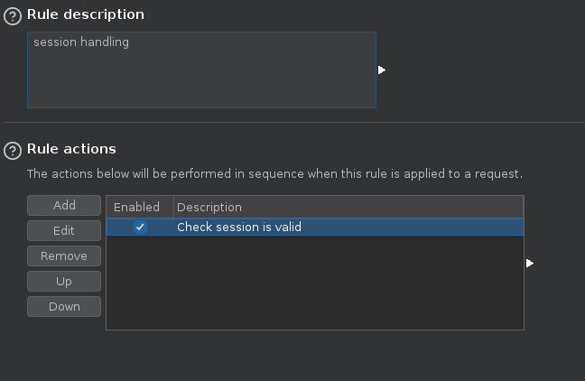
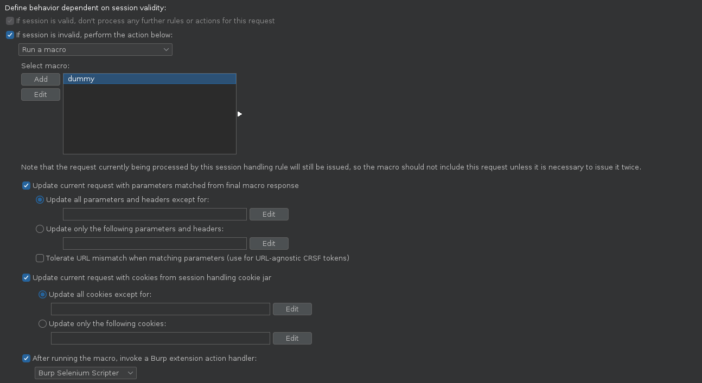
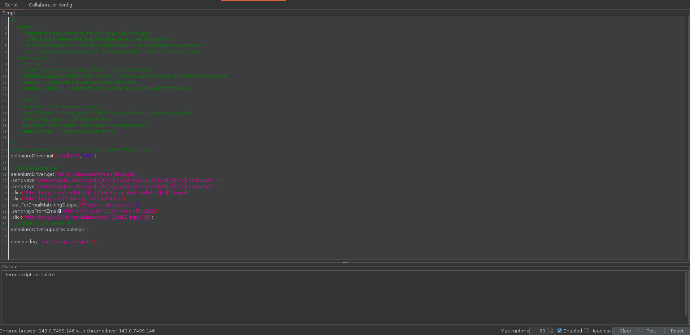
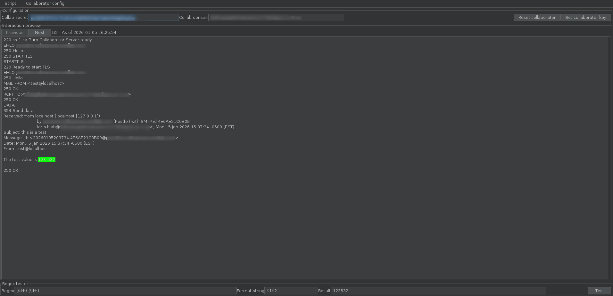

# 🤖 Burp Selenium Scripter
Burp Selenium Scripter allows pentesters to script login sequences using a simple builder pattern that
utilizes XPath to target elements. This can be combined with other extensions such as [Multi-TOTP Authenticator](https://github.com/portswigger/multi-totp-authenticator) 
and [Hotpatch](https://github.com/portswigger/hotpatch) to handle TOTP as well as tracking of non-cookie based session tokens.

# Features
1. Simple script editor to edit your scripts.
2. Timeout configuration.
3. Full JavaScript environment with `seleniumDriver` helper object included for easy creation of flows.
4. Handle email MFA with collaborator.

# Setup
- Install the extension
- Install `chromedriver` for your OS and make sure it is on the `PATH`. You can obtain chromedriver from the [Chrome release channel](https://googlechromelabs.github.io/chrome-for-testing/#stable).
- If everything is working properly the extension will show the chromedriver version in use

# Example usage
For our example we will use the [Altoro Mutual](https://demo.testfire.net) test site. This site uses 
cookie-based authentication and has a fairly simple login process.

While this could be accomplished with the Burp Suite Session Handling Macros, this example illustrates the capabilities of the Burp Selenium Scripter.

Below is a simple script that performs the following actions:
1. Initializes the selenium driver with the host and port of a proxy server ( Burp in most cases ).
2. Navigates to the first URL in the login flow.
3. Enters the text `admin` in the username and password input fields.
4. Clicks the submit button.
5. Clicks a link available only on a logged in page.
6. Updates the burp cookie jar.
7. Prints some text to the log.

### Sample login script for https://demo.testfire.net
```javascript
seleniumDriver.init("localhost",8080);

// Run the sequence
seleniumDriver.get("https://demo.testfire.net/login.jsp")
.sendKeys("/html/body/table/tbody/tr[2]/td[2]/div/form/table/tbody/tr[1]/td[2]/input","admin")
.sendKeys("/html/body/table/tbody/tr[2]/td[2]/div/form/table/tbody/tr[2]/td[2]/input","admin")
.click("/html/body/table/tbody/tr[2]/td[2]/div/form/table/tbody/tr[3]/td[2]/input")
.click("/html/body/table[2]/tbody/tr/td[1]/ul/li[1]/a");
// Update Burp's cookie jar and stop the driver
seleniumDriver.updateCookieJar();

console.log("Demo script complete");
```

If the login flow requires a code sent via email you can use the collaborator domain provided by the extension and then
use the commands below to wait for an email and extract content from the email to use later in the flow.

```javascript
.waitForEmailMatchingSubject("Subject: this is a test",10)
.sendKeysFromEmail("//*[@id=\"query\"]","(\\d+)-(\\d+)","$1$2")
```

# Tips
- To update Burp's cookie jar call `updateCookieJar` at the end of your script
- You might need to add delays for JavaScript events to happen
- Scripts will always be disabled on project load because the script execution environment isn't locked down

# Advanced case with MFA or Authorization Headers
Login flows that require the insertion of MFA tokens can be handled with [Multi-TOTP Authenticator](https://github.com/portswigger/multi-totp-authenticator). Simply set the MFA 
code in the flow to something unique like "321123" and it will be replaced whenever an MFA token is required. 

To handle tracking of header-based session tokens after authentication [Hotpatch](https://github.com/portswigger/hotpatch) can be used. By creating a "reader" script
you can catch tokens provided after login and store them for later use. A "writer" script can then be used to update the tokens in requests that flow through the proxy.


## Hotpatch: Http Response received Handler ( Reader script )

```javascript
var RequestToBeSentAction = Packages.burp.api.montoya.http.handler.RequestToBeSentAction;
var ResponseReceivedAction = Packages.burp.api.montoya.http.handler.ResponseReceivedAction;
var HttpRequestToBeSent = Packages.burp.api.montoya.http.handler.HttpRequestToBeSent;
var HttpResponseReceived = Packages.burp.api.montoya.http.handler.HttpResponseReceived;

var Matcher = Packages.java.util.regex.Matcher;
var Pattern = Packages.java.util.regex.Pattern;

function handleHttpResponseReceived(montoyaApi, httpResponseReceived) {
    p = Pattern.compile("access_token\":\"([^\"]+)\"",Pattern.MULTILINE|Pattern.DOTALL);
    m = p.matcher(httpResponseReceived.bodyToString());
    if (m.find()) {
        memory.setString("demoToken",m.group(1));
    }
    return ResponseReceivedAction.continueWith(httpResponseReceived);
}
```
The above script reads the access token out of a request and stores it with the key `demoToken` for later use

## Hotpatch: Http Request Sent Handler ( Writer script )
```javascript
var RequestToBeSentAction = Packages.burp.api.montoya.http.handler.RequestToBeSentAction;
var ResponseReceivedAction = Packages.burp.api.montoya.http.handler.ResponseReceivedAction;
var HttpRequestToBeSent = Packages.burp.api.montoya.http.handler.HttpRequestToBeSent;
var HttpResponseReceived = Packages.burp.api.montoya.http.handler.HttpResponseReceived;

function handleHttpRequestToBeSent(montoyaApi, httpRequestToBeSent) {
    var token = null;
    try {
        token = memory.getString("demoToken");
    }
    catch (e) {
        ;
    }
    if ( token != null && httpRequestToBeSent.httpService().host() == "test.host.com") {
        httpRequestToBeSent = httpRequestToBeSent.withUpdatedHeader("Authorization","Bearer " + token)
    }
    return RequestToBeSentAction.continueWith(httpRequestToBeSent);
}
```
The above script writes the token stored with the key `demoToken` on certain requests

### High level flow:
1. Burp session handler sees a request is out of session.
2. Invokes the macro which sends a "dummy" request.
3. Burp Selenium Scripter is then run and the login process is replayed.
4. The hotpatch "reader" script picks up the token and stores it.
5. The original request is resent.
6. The hotpatch "writer" script updates the request with the new token.

# Burp Configuration
To use the Burp Selenium Extension in a login flow you proceed as you normally would by adding a session validity check.



The key difference is to add a "dummy" request macro simply so that you can check the box to run an extension after the macro completes.



# Extension configuration

When the extension loads it will perform a check to see if there is a Chrome browser with a compatible chromedriver. If
this test fails a warning will appear at the bottom left, otherwise the chrome browser and driver versions will be
displayed. The default script includes instructions on how to quickly get up and running.



Your Burp Suite Colloborator details and regexes for parsing inbound emails can be tested by selecting the 'Collaborator config' tab.



# Tips For Building a Session Handling Flow
- When creating your accounts, copy the QR codes for TOTP MFA. You will need this to configure the TOTP extension.
- Build a list of markers that identify a logged out request ( timeout/invalidated ).
- Document all required XPaths while performing the login flow.
- Make note of any areas that may take a second to render or areas that have events that must fire prior to being used.
- Click something once you've logged in to allow post login events to run in the target app.

# Selenium Driver Functions

Every script will have the seleniumDriver object injected into it so that you can control selenium. The following API
can be used to customize your login flow.

Driver functions ( all return void ):
- `init(String proxyHost, int proxyPort)` - Initialize the driver
- `setDefaultRenderWaitTimeSec( int sec )` - Set the default wait for a component to render
- `updateCookieJar()` - Close the browser and stop the driver

Builder functions ( returns a selenium driver object ):
- `get( String url )` - Navigate to a URL
- `waitForElement( String XPath )` - Wait for an element to become available
- `click( String XPath )` - Click an element
- `sendKeys( String XPath, String keys )` - Keyboard input
- `delay( int sec )` - Pause for a given time
- `waitForEmailMatchingRegex( String regex, int maxWaitSec )` - Waits until an email is received matching the given regex
- `sendKeysFromEmail ( String XPath, String extractionRegex, String formatString )` - Gets text from an email and interpolates the regex match groups into a format string
- `getFromEmail( String extractionRegex, String formatString )` - Similar to the `get(String url)` function but it gets the URL from the email using a regex and format string